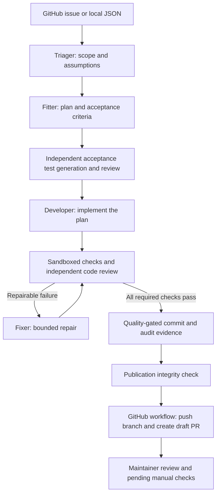

# Issue to Reviewed PR · ThreadCraft

Turn a GitHub issue into a tested, independently reviewed **draft pull request**, with evidence for a maintainer to inspect before merging. This repository combines an AI development workflow with **ThreadCraft**, a React storefront used to demonstrate real application changes.

## The problem it solves

An issue-to-code automation needs more than a generated patch: it needs a clear scope, tests tied to the requested behavior, regression checks, review, and a record of what actually ran. This project automates those steps, blocks publication when required checks fail, and preserves failure evidence for investigation. A maintainer still reviews the draft PR and completes any pending browser checks before merging.

## What has been built

- **ThreadCraft storefront:** product search, category filters, price sorting, size/color selection, stock-aware cart quantities, subtotal calculation, and free-shipping progress. Checkout is a UI simulation; it does not collect payments. Product images are local SVGs.
- **Issue intake and planning:** local JSON or GitHub issues become repository-aware diagnoses, documented assumptions, scoped implementation plans, and acceptance criteria.
- **Independent acceptance tests:** tests are generated and reviewed before development, then frozen so the Developer and Fixer cannot change their contract.
- **Implementation and repair:** the Developer applies the plan; the Fixer uses failed assertions and review findings for up to three repair retries.
- **Quality and publication gates:** type checking, production build, regressions, changed-file formatting, diff hygiene, independent acceptance tests, and review must pass before a commit. Publication checks bind the reviewed evidence to the commit.
- **Audit and failure investigation:** per-cycle reports, source snapshots, patches, API usage, and PR summaries are saved under `work/`.
- **GitHub automation:** issue events run the pipeline on macOS and publish a draft PR; PR quality checks validate subsequent updates. Separate workflows upload successful production builds to the configured S3 prefix.

The current storefront shipping threshold is **$499**, defined in `src/components/ShippingProgress.tsx`. The offline sample requests **$75**; running it may change the application threshold.

## How the workflow works



Blocking questions, invalid acceptance tests, exhausted repair limits, and provider/runner failures stop the run with diagnostic artifacts. Local scripts stop at a local commit and PR summary; remote publication happens in the GitHub workflow. There is no automatic merge.

## Skills and tools used

The implemented skills are worker capabilities in `src/harness/workers/`:

| Skill / role             | Responsibility                                                                                                |
| ------------------------ | ------------------------------------------------------------------------------------------------------------- |
| Triager                  | Read the issue and repository, identify scope, resolve supported assumptions, and surface blocking questions. |
| Fitter                   | Select justified application and regression-test paths and build the implementation plan.                     |
| Acceptance test engineer | Generate independent tests, validate fixtures and DOM isolation, and record manual checks.                    |
| Developer                | Implement the approved plan within its allowed paths.                                                         |
| Tester                   | Execute isolated checks and preserve detailed test evidence.                                                  |
| Reviewer                 | Independently assess completeness, regressions, and acceptance-test validity.                                 |
| Fixer                    | Repair actionable failures within the retry budget.                                                           |

These are application worker roles. The repository does not record which external Codex `SKILL.md` packages were used during its development.

**Stack:** React 18, TypeScript, Vite, Tailwind CSS, Vitest, React Testing Library, OpenAI Responses API, GitHub CLI/Actions, Valkey through `ioredis`, native macOS `sandbox-exec`, and S3 build uploads. Offline mode uses deterministic shipping-specific behavior; AI mode uses the configured model for broader application issues.

## How to use it

### 1. Run the storefront

Use Node.js 22 and pnpm 10.26.2 to match CI:

```bash
git clone https://github.com/hirakroya50/product008.git
cd product008
pnpm install --frozen-lockfile
pnpm dev
```

Open the local URL printed by Vite. Browse products, choose variants, add items, and change quantities to see cart totals and shipping progress update.

### 2. Verify the application

```bash
pnpm typecheck
pnpm test
pnpm build
pnpm harness help
```

### 3. Run the offline issue-to-commit demo

The harness runner requires **macOS with `sandbox-exec`** and a **clean, committed Git checkout**. No OpenAI key is needed for the offline demo.

```bash
pnpm harness doctor
pnpm demo
```

The demo reads `docs/product-008/sample-issue.json`, verifies or implements the $75 shipping feature, runs the quality gates, and creates a local `codex/issue-*` branch and commit when changes are needed. It saves a PR summary under `work/<work-id>/pr-summary.md` and audit evidence in `docs/product-008/evidence.json`. It does not push or create a remote PR. Repeated runs verify an already-applied feature without manufacturing a change.

### 4. Process a real GitHub issue locally

Authenticate the GitHub CLI with `gh auth login`. Copy `.env.example` to `.env`, set `HARNESS_MODE=openai`, and supply `OPENAI_API_KEY` and an explicit `OPENAI_MODEL` supporting strict structured outputs. Optionally set `VALKEY_URL` for shared leases. Keep `.env` private.

```bash
cp .env.example .env
# Edit .env with your configuration before continuing.
set -a
source .env
set +a
bash scripts/run-issue.sh 123
```

Replace `123` with your issue number. This script approves paid API usage for the run and can create a local branch and commit; it stops before remote publication. API execution is limited to 16 recorded requests, including retries. For the deterministic shipping workflow, explicitly use `HARNESS_MODE=offline` instead.

To inspect a failed run without API calls:

```bash
pnpm harness inspect --work YOUR_WORK_ID
```

### 5. Enable automatic GitHub draft PRs

Follow the full [GitHub issue → draft PR setup guide](docs/product-008/github-demo.md). In brief:

1. Ensure the four files in `.github/workflows/` are on the default branch and Actions is enabled.
2. Configure Actions secrets `OPENAI_API_KEY` and `VALKEY_URL`, plus `OPENAI_MODEL` as a secret or variable. AI mode is the default; explicit offline mode does not require an OpenAI key.
3. Enable **Allow GitHub Actions to create and approve pull requests** in repository Actions settings. The workflow creates drafts and does not approve or merge them.
4. Open or reopen an application issue, or manually run **Product 008 - Reviewed issue to draft PR** with an issue number.
5. Review the resulting draft PR, its evidence, and pending browser checks. Require **PR quality / quality** and maintainer approval through branch protection.

Example issue: **Change the free shipping threshold to $100**. Specify that progress should update with subtotal, clamp at 100%, show unlocked messaging at or above $100, and preserve cart stock behavior.

S3 uploads use the repository's existing bucket configuration and require AWS Actions secrets; see [Pull request builds in S3](#pull-request-builds-in-s3). They upload build files, not a complete hosted checkout/payment service.

## Repository map

| Path                                            | Contents                                                                      |
| ----------------------------------------------- | ----------------------------------------------------------------------------- |
| `src/App.tsx`, `src/components/`, `src/cart.ts` | Storefront and cart behavior                                                  |
| `src/harness/`                                  | CLI, orchestration, workers, quality gates, evidence, leases, and diagnostics |
| `src/__tests__/`                                | Storefront and harness regression tests                                       |
| `scripts/demo.sh`                               | Offline local demonstration                                                   |
| `scripts/run-issue.sh`                          | GitHub issue intake through local commit and audit                            |
| `.github/workflows/`                            | Issue pipeline, PR validation, and build uploads                              |
| `docs/product-008/`                             | Sample issues and detailed GitHub setup                                       |
| `work/`                                         | Ignored run artifacts; retain these when sharing audit evidence               |

The sections below document execution safeguards, audit scope, and deployment configuration in more detail.

## Stage A pipeline

Local JSON (`intake`) or GitHub CLI (`intake-issue`, requires authenticated `gh`) → repository-aware Triager → Fitter and independent acceptance tests → Developer → sandboxed Tester and independent reviewer → bounded Fixer → quality-gated Git commit → evidence-backed draft PR → maintainer review. Run `pnpm harness help` for commands. Use `--work work-ID` and explicit `--approve-write`; AI triage and fitter additionally require `--approve-cost`. AI triage saves approval before the first API request.

Offline triage/developer support the sample $75 shipping progress feature. Unsupported requests stop for human clarification. `HARNESS_MODE=openai`, `OPENAI_API_KEY`, and an explicit `OPENAI_MODEL` enable repository-aware Responses API triage, planning, development, acceptance-test generation and independent review. Structured outputs use strict schemas, incomplete/refused responses fail closed, and the per-work API ledger limits execution to 16 requests with recorded usage, including retry attempts. Temporary rate limits and server failures get up to three attempts with server-directed delays or bounded exponential backoff. Quota, billing and authentication errors fail immediately; long server retry delays are deferred. `doctor --ai-probe` explicitly invokes paid inference. Standard doctor only verifies offline inference. No live API or Valkey validation is implied by offline success.

Runner: macOS native `sandbox-exec`, temporary copy, no network, writes restricted to the copy, stripped environment. It is a local demo sandbox sharing read access and dependencies with its host, not an adversarial production isolation boundary. Other platforms fail readiness until a runner adapter is implemented. Commands have 180-second limits and log capture; fixer has a maximum of three retries. Git requires fresh successful typecheck, build, regression, changed-file formatting, diff hygiene, independent acceptance tests and review checks, and rejects changes outside the plan. Skipped tests and blocking P0–P2 review findings fail the gate. Acceptance tests are checked for DOM isolation and independently reviewed for valid fixtures, APIs and meaningful criterion coverage before freezing. Invalid test generation can retry up to three times with its findings recorded. Approved tests are saved before development, injected only into the sandbox and protected from Developer/Fixer edits. Test/review evidence is bound to the code fingerprint and artifact hashes; publication verifies the reviewed commit and clean branch. Plan and context hashes detect intervening edits. The Fixer receives failed assertions (including expected/actual values and stack traces) and review findings, saves every cycle, and stops early when a repair makes no code changes. Vitest JSON reports are preserved on success and failure before sandbox cleanup, alongside candidate source snapshots and diffs. `pnpm harness inspect --work work-ID` reads failure evidence without API calls. Failed workflows show an investigation summary and preserve the same records in their artifact. Work artifacts live in ignored `work/`.

Without `VALKEY_URL`, leases use an in-memory smoke adapter and an atomic filesystem lock for cross-process workspace edits. Filesystem locks deliberately do not expire; if a writer crashes, inspect the PID in `work/.workspace-lock/owner.json`, then remove the stale directory manually. Configured Valkey connection failures fail closed, with owner-checked renewal and release.

## Evidence and numbering

`docs/product-008/evidence.json` is generated by the demo from actual artifacts and is ignored to avoid circular commit SHA references. `acceptance-status` checks 15 active Stage A records, their artifact hashes, the recorded commit, and the clean checkout. Preserve `work/` alongside the registry when sharing audit evidence. Deleting or changing artifacts makes validation fail.

The request assigns cases 14–15 to both active Stage A and deferred Stage B. Records use `(stage, caseId)` identities: A:1–15 active, B:14–20 deferred, with the requested deferred reason. A:14–15 verify local audit artifacts and integrity. Stage B audit cases remain deferred. PR production uploads are configured separately below; Product 007 contracts and hostname integration are not implemented.

Repeated demo runs verify the shipping feature idempotently; when it is already applied, Git reports the existing HEAD rather than manufacturing a code change.

The optional API adapter follows the [official Responses API documentation](https://developers.openai.com/api/docs/guides/text).

## Automatic GitHub issue demo

See [GitHub issue to draft PR setup](docs/product-008/github-demo.md). The workflow runs on newly opened/reopened issues from any author, uses hosted Valkey from Actions secrets, defaults to AI mode for general application issues, supports explicit offline shipping mode, and stops at a draft PR for human review. PR quality CI reruns typecheck, tests, build, formatting and diff checks on each PR update.

## Implementation scope and review expectations

AI mode selects up to 24 justified paths across application `src/` code, styles, data, types, regression tests and Markdown documentation. At least one implementation path and one regression test path are required; there is no minimum changed-file count. Existing cart integration may correctly stay unchanged for a shipping threshold issue. The PR summary reports actual changed files and explains planned files retained without edits.

The harness, pipeline tests, test setup, dependencies, secrets, CI and infrastructure are protected from generated patches. New dependencies, file deletions, migrations and changes outside this React/TypeScript application need a maintainer-directed workflow. Triage proceeds with documented assumptions for routine implementation choices supported by the issue and source, including keeping copy for the same shipping offer consistent. Explicit scope exclusions take precedence. If triage still raises questions, one bounded resolution pass must account for every question and justify any assumption; genuine missing business rules still stop with questions in `diagnosis.json`. Assumptions are carried into the plan and PR summary.

Independent tests and AI review improve evidence but cannot guarantee senior-engineer quality. Generated tests can still miss a requirement, and review can miss a defect. Visual/browser validation, external integration behavior and other manual checks are listed in the plan and PR. Acceptance generation stores concrete browser steps under `manualVerification` in `acceptance-tests.json`, associated with criterion IDs, and copies them into the draft PR as pending verification. Vitest/jsdom assertions cover automated requirements; passing checks do not prove rendered clipping, focus-ring visibility or viewport layout. Maintainers must complete the pending browser checks before merging. Configure branch protection to require **PR quality / quality** and maintainer approval. The current macOS runner is a demo isolation boundary, not a hardened runner for untrusted company repositories; see the runner limitations above before rollout.

### Pull request builds in S3

Production build contents upload to `s3://lotus-ai-teach-team/hirak/<branch-name>/` in `us-east-1`. Branch slashes are preserved: `codex/issue-31` uses `hirak/codex/issue-31/`. Updates reuse the branch prefix without deleting existing objects. Forks with the same branch name share a prefix; use unique names.

Add rotated credentials as repository Actions secrets `AWS_ACCESS_KEY_ID` and `AWS_SECRET_ACCESS_KEY`. Grant `s3:PutObject` on `arn:aws:s3:::lotus-ai-teach-team/hirak/*` (plus multipart-upload permissions if needed). Never commit credentials. Commit and push all four workflows and the harness fixes to the default branch before running.

PR quality builds without AWS credentials and preserves `pr-dist`. A separate successful-run workflow uploads the artifact without checking out or executing PR code, including for fork PRs. The issue pipeline also preserves and uploads `issue-dist` after publishing a PR, because `GITHUB_TOKEN`-created PRs do not trigger normal PR workflows. Failed checks do not upload. GitHub may require maintainer approval for first-time fork contributors; manual dispatch still requires normal repository permissions. Enable “Allow GitHub Actions to create and approve pull requests” in repository Actions settings for automated draft PR creation.
